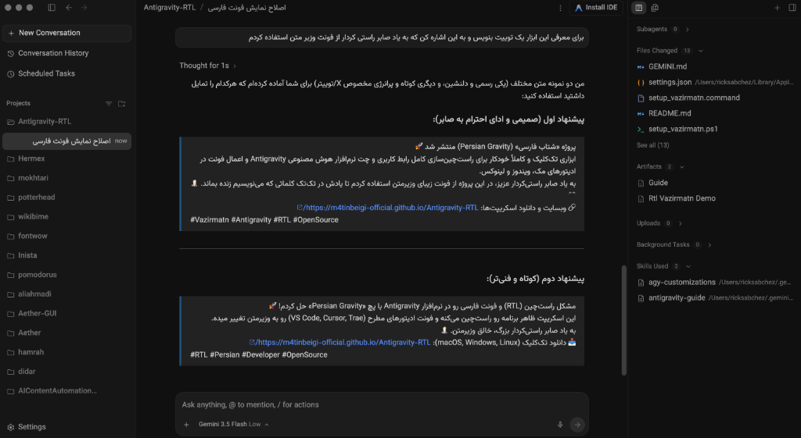

# جاذبية فارسي (Persian Gravity) 🚀

محاذاة ذكية من اليمين إلى اليسار (RTL) وتطبيق خط "وزير متن" لبرنامج الذكاء الاصطناعي Antigravity وأبرز محررات الأكواد (VS Code, Cursor, Trae, VSCodium, Windsurf).

> 🟢 **تم الاختبار والتحقق على:** `macOS 15.7.3 (Sequoia)` و `Antigravity v2.6.0` (بنجاح كامل)

---

### **في ذكرى صابر راستي كردار 🕯️**
> يُهدا هذا المشروع إلى روح الراحل **صابر راستي كردار** (مبتكر الخطوط الحرة الجميلة مثل وزير متن، شبنم، صميم، ساحل، وغندم)، الذي أضفى جمالاً استثنائياً على الخطوط والكتابة باللغات الشرقية عبر الويب والمنصات الرقمية. رحمه الله وغفر له.

---

## 🌐 لغات أخرى
- [🇺🇸 English (الإنجليزية)](./README.md)
- [🇮🇷 نسخه فارسی (الفارسية)](./README-FA.md)
- [🇮🇱 עברית (العبرية)](./README-HE.md)

---

## 🛠️ مميزات المشروع
- **التعديل التلقائي لواجهة Antigravity**: محاذاة ذكية من اليمين إلى اليسار (RTL) لنافذة الدردشة، القوائم، واللوحات العامة.
- **تثبيت الخطوط تلقائياً**: تحميل وتثبيت خط "وزير متن" مباشرة في مكتبة الخطوط على نظام التشغيل.
- **تعديل إعدادات المحررات**: تحديث ملفات الإعدادات تلقائياً لاستخدام خط وزير متن في محررات الأكواد مثل Antigravity, VS Code, Cursor, Trae, VSCodium, و Windsurf.
- **دعم أنظمة تشغيل متعددة**: توفير سكربتات خاصة لكل من macOS و Windows و Linux.

## 🚀 التثبيت بنقرة واحدة
لتثبيت الخط وتطبيق التعديلات تلقائياً، قم بتشغيل السكربت المخصص لنظامك:
- **macOS**: قم بتحميل وتشغيل [`setup_vazirmatn.command`](./setup_vazirmatn.command)
- **Windows**: قم بتشغيل [`setup_vazirmatn.ps1`](./setup_vazirmatn.ps1) باستخدام PowerShell
- **Linux**: قم بتشغيل [`setup_vazirmatn_linux.sh`](./setup_vazirmatn_linux.sh)

---

## 🔗 المشاريع ذات الصلة
- **[claude-rtl-patcher](https://github.com/m4tinbeigi-official/claude-rtl-patcher)**: أداة مشابهة لتعديل تطبيق Claude Desktop وإضافة دعم اليمين إلى اليسار (RTL) وخط وزير متن.
